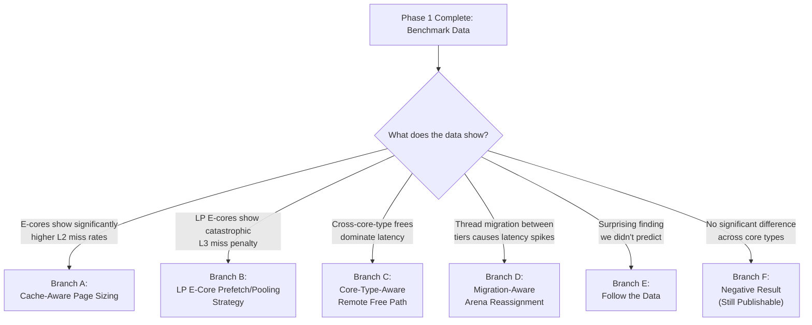

# Implementation Plan: Concurrent Memory Allocators on Heterogeneous Multicore Systems

## Hardware Correction

> [!CAUTION]
> **Previous analysis assumed Alder Lake / Raptor Lake (12th–14th Gen). This is WRONG.**
> Your processor is an **Intel Core Ultra 5 125H (Meteor Lake)** — Intel's first **disaggregated chiplet architecture** for client processors. This is a fundamentally different and more complex topology than what was previously described.

### Corrected Hardware Topology

Your system is a **THREE-TIER** heterogeneous architecture, not two-tier:

```
┌─────────────────────────────────────────────────────────────────┐
│                    Intel Core Ultra 5 125H                      │
│                       (Meteor Lake)                             │
│                                                                 │
│  ┌────────────────────────────────────────────────────────┐     │
│  │              COMPUTE TILE (Intel 4 process)            │     │
│  │                                                        │     │
│  │  ┌──────────┐ ┌──────────┐ ┌──────────┐ ┌──────────┐  │     │
│  │  │ P-Core 0 │ │ P-Core 9 │ │P-Core 10 │ │P-Core 11 │  │     │
│  │  │ Redwood  │ │ Redwood  │ │ Redwood  │ │ Redwood  │  │     │
│  │  │  Cove    │ │  Cove    │ │  Cove    │ │  Cove    │  │     │
│  │  │ L1d:48KB │ │ L1d:48KB │ │ L1d:48KB │ │ L1d:48KB │  │     │
│  │  │ L2: 2MB  │ │ L2: 2MB  │ │ L2: 2MB  │ │ L2: 2MB  │  │     │
│  │  │ PRIVATE  │ │ PRIVATE  │ │ PRIVATE  │ │ PRIVATE  │  │     │
│  │  │ HT: Yes  │ │ HT: Yes  │ │ HT: Yes  │ │ HT: Yes  │  │     │
│  │  └──────────┘ └──────────┘ └──────────┘ └──────────┘  │     │
│  │                                                        │     │
│  │  ┌────────────────────┐  ┌────────────────────┐       │     │
│  │  │ E-Core Cluster 1   │  │ E-Core Cluster 2   │       │     │
│  │  │ Cores 1,2,3,4      │  │ Cores 5,6,7,8      │       │     │
│  │  │ Crestmont ×4       │  │ Crestmont ×4       │       │     │
│  │  │ L1d: 32KB each     │  │ L1d: 32KB each     │       │     │
│  │  │ L2: 2MB SHARED     │  │ L2: 2MB SHARED     │       │     │
│  │  │ HT: No             │  │ HT: No             │       │     │
│  │  └────────────────────┘  └────────────────────┘       │     │
│  │                                                        │     │
│  │           ┌───────────────────────┐                   │     │
│  │           │   L3: 18 MB SHARED    │                   │     │
│  │           │  (P-cores + E-cores)  │                   │     │
│  │           └───────────────────────┘                   │     │
│  └────────────────────────────────────────────────────────┘     │
│                          ↕ Foveros 3D interconnect                │
│  ┌────────────────────────────────────────────────────────┐     │
│  │                SoC TILE (TSMC N6 process)              │     │
│  │                                                        │     │
│  │  ┌─────────────────────┐                              │     │
│  │  │  LP E-Core Cluster  │                              │     │
│  │  │  Cores 12, 13       │     ⚠ NO L3 ACCESS           │     │
│  │  │  Crestmont ×2       │     (different physical tile) │     │
│  │  │  L1d: 32KB each     │                              │     │
│  │  │  L2: 2MB SHARED     │                              │     │
│  │  │  HT: No             │                              │     │
│  │  └─────────────────────┘                              │     │
│  └────────────────────────────────────────────────────────┘     │
└─────────────────────────────────────────────────────────────────┘
```

### Three Tiers — Not Two

| Tier | Cores | Microarch | L1d | L2 | L3 | Tile | Logical CPUs |
|:---|:---|:---|:---|:---|:---|:---|:---|
| **Tier 1: P-cores** | 0, 9, 10, 11 | Redwood Cove | 48 KB private | 2 MB **private** | 18 MB shared | Compute | 8 (HT) |
| **Tier 2: E-cores** | 1–4, 5–8 | Crestmont | 32 KB private | 2 MB **shared/4** | 18 MB shared | Compute | 8 |
| **Tier 3: LP E-cores** | 12, 13 | Crestmont | 32 KB private | 2 MB **shared/2** | ❌ **None** | SoC | 2 |

> [!IMPORTANT]
> **The LP E-cores (Cores 12–13) have NO L3 cache access.** They sit on a physically separate tile (SoC tile, TSMC N6) connected via Foveros 3D interconnect. An L2 miss on these cores goes directly to main memory, skipping 18 MB of L3 entirely. This is a massive architectural asymmetry that no allocator accounts for.

### Why This Is Better For Your Project

The previous assumption (two-tier P/E) is common and well-understood. **Your actual hardware has a third tier that almost nobody discusses in the context of memory allocation.** This gives you:

- A genuinely novel measurement axis (allocator behavior on cores with no L3)
- A stronger "gap" argument (even papers about hybrid cores ignore LP E-cores)
- Three scheduling conditions instead of two (P-only, E-only, LP-E-only, plus mixed)

---

## Proposed Changes

### Phase 1: Empirical Analysis (Broad, Thorough)

**Goal**: Benchmark every feasible allocator across all three core tiers. Record everything. This is pure observation — nothing can go wrong.

#### Allocators — Windows-Feasible Only

| Allocator | Build Method | Effort | Priority |
|:---|:---|:---|:---|
| **MSVC CRT malloc** | Already linked — it's your default | Zero | ✅ Baseline |
| **mimalloc** (dev3 branch) | CMake, native Windows | Trivial | ✅ Must have |
| **rpmalloc** | Single C file, `#include` and go | Trivial | ✅ Must have |
| **snmalloc** | CMake, Windows supported (MS Research) | Easy | ✅ Should have |
| **jemalloc** | vcpkg: `vcpkg install jemalloc` | Medium | ✅ Should have |
| **Intel TBB `scalable_allocator`** | vcpkg or oneAPI toolkit (you may already have it) | Medium | ⚠️ Nice to have |
| **tcmalloc** | vcpkg has it; or Bazel | Harder | ⚠️ Try, skip if painful |
| **Hoard** | Older Windows support, may need porting | Hard | ❌ Skip unless easy |
| **Supermalloc** | Linux-only (uses `madvise`, etc.) | Infeasible | ❌ Skip |
| **glibc ptmalloc2** | Linux-only | Infeasible | ❌ Skip |

**Realistic target: 5–6 allocators** (MSVC CRT, mimalloc, rpmalloc, snmalloc, jemalloc, optionally TBB).

#### Scheduling Conditions (4 Modes)

| Mode | Thread Pinning | Cores Used | Purpose |
|:---|:---|:---|:---|
| **P-only** | All threads pinned to logical CPUs 0–1, 10–11, 12–13, 14–15 (P-core masks) | 4 P-cores (8 threads max) | Peak performance baseline |
| **E-only** | All threads pinned to E-core logical CPUs (compute tile) | 8 E-cores (8 threads max) | Compute-tile efficiency cores |
| **LP-E-only** | All threads pinned to logical CPUs of cores 12–13 | 2 LP E-cores (2 threads max) | The **no-L3** tier — novel data |
| **Mixed** | No pinning, OS + Thread Director decides | All 14 cores | Real-world behavior |

#### Workloads

| Workload | What It Tests | Implementation |
|:---|:---|:---|
| **Alloc-Free Burst** | Raw allocator speed: each thread does N malloc/free pairs of fixed size | Simple loop |
| **Producer-Consumer** | Cross-thread free path: Thread A allocs, Thread B frees via shared queue | Relates to your base paper [1] BatchIt |
| **Mixed Sizes** | Size-class pressure: random sizes from 8B to 64KB | Tests binning/fragmentation |
| **Realistic** | End-to-end: programs from mimalloc-bench (cfrac, espresso, barnes, etc.) | Use existing benchmarks |

#### Metrics (Don't Hold Back)

| Metric | How To Measure | Why It Matters |
|:---|:---|:---|
| **Throughput** (ops/sec) | `QueryPerformanceCounter` around N iterations | Primary performance metric |
| **Latency** (avg, P50, P99, P999) | Per-operation timestamps, build histogram | Tail latency reveals contention |
| **L1d cache miss rate** | VTune or `perf` counters (HW PMU) | Allocator metadata fitting in cache |
| **L2 cache miss rate** | VTune | Shared L2 impact on E-core clusters |
| **L3 cache miss rate** | VTune | LP E-cores will show massive L3 miss (they have none) |
| **RSS (physical memory)** | `GetProcessMemoryInfo` | Memory efficiency / overhead |
| **Peak Virtual Memory** | `GetProcessMemoryInfo` | Allocator virtual space usage |
| **Context switches** | VTune / Windows perf counters | Contention causing OS-level interference |
| **Instructions retired** | VTune | Work done per unit time (IPC proxy) |

#### VTune Integration
Since you have VTune 2026.3 installed, you can collect hardware counters without any code changes. You'd run:
```
vtune -collect memory-access -- your_benchmark.exe
vtune -collect hotspots -- your_benchmark.exe
vtune -collect microarchitecture-exploration -- your_benchmark.exe
```
VTune on Windows has full access to hardware PMU counters. No WSL needed.

---

### Phase 2: Decision Point (Data-Driven Branching)

After Phase 1, you will have a matrix of results. Based on what the data shows, you pick **one** implementation branch:



#### Branch A: Cache-Aware Page Sizing
**Trigger**: E-core threads show measurably higher L2 cache miss rates because 4 threads share one 2 MB L2.
**Modification**: In mimalloc, reduce the page size (currently 64 KB default) for threads detected on E-cores, so the allocator's working set fits in the smaller effective L2 budget (~512 KB per E-core thread).
**Effort**: Small code change in mimalloc's `_mi_page_alloc`.

#### Branch B: LP E-Core Memory Strategy
**Trigger**: LP E-cores (cores 12–13) show catastrophically higher memory access latency because they lack L3.
**Modification**: For threads on LP E-cores, implement aggressive object pooling or larger batch prefetching from main memory to amortize the L3-miss penalty. Or: simply recommend never running allocation-heavy workloads on LP E-cores (a scheduling-level finding).
**Effort**: Medium — involves modifying mimalloc's segment allocation to pre-fault pages.

#### Branch C: Core-Type-Aware Remote Free Path
**Trigger**: Producer-consumer workloads where producer is on a P-core and consumer (freeing) is on an E-core (or vice versa) show disproportionately high latency compared to same-tier producer-consumer.
**Modification**: In mimalloc, modify the "thread free list" (the list where remote threads deposit freed objects) to batch differently based on whether the free is cross-tier vs same-tier.
**Effort**: Medium — touches mimalloc's `_mi_free_block_mt`.

#### Branch D: Migration-Aware Arena Reassignment
**Trigger**: VTune shows frequent thread migrations between P-cores and E-cores, and each migration causes a measurable allocation latency spike.
**Modification**: Detect core-type change at allocation time (cheap: `GetCurrentProcessorNumber()` → lookup table), and when a tier change is detected, lazily migrate the thread's hot free lists to be more cache-friendly for the new tier.
**Effort**: Medium-high — requires understanding mimalloc's heap structure deeply.

#### Branch E: Follow the Data
**Trigger**: Something unexpected shows up (e.g., one particular allocator handles the asymmetry dramatically better/worse, or a specific size class is disproportionately affected).
**Modification**: TBD based on observation.
**Effort**: Unknown.

#### Branch F: Negative Result
**Trigger**: All allocators perform roughly proportionally across core types (E-cores are slower but proportionally so, no outliers).
**Finding**: The architectural asymmetry does not meaningfully affect allocator *design*, only raw throughput. The OS scheduler + Thread Director adequately handles placement. This is a publishable, valid conclusion.
**Deliverable**: The benchmark data itself is the contribution.

---

### Phase 3: Implementation (After Branch Selection)

1. Fork mimalloc (dev3 branch)
2. Add core-type detection (extend your `hardware_stats.cpp` into a reusable library)
3. Implement the selected branch modification
4. Re-run the Phase 1 benchmarks with modified mimalloc vs unmodified
5. Compare and analyze

---

## Verification Plan

### Automated Tests
- Each benchmark runs 5 times per configuration, report mean ± std dev
- Validate allocation correctness: every `malloc` returns non-null, every `free` doesn't double-free
- Cross-check VTune counter data against `QueryPerformanceCounter` wall-clock times for consistency

### Manual Verification
- Verify thread pinning is actually working by checking `GetCurrentProcessorNumber()` inside benchmarked threads
- Confirm VTune is reporting per-core-type counters correctly by comparing P-core-only vs E-core-only runs
- Sanity check: LP E-core L3 miss rate should be ~100% (they have no L3) — if not, pinning is wrong

---

## Open Questions

> [!IMPORTANT]
> 1. **What is your project deadline?** This affects how many allocators and workloads we realistically benchmark before moving to Phase 2.
> 2. **Do you have vcpkg or MSYS2 installed?** This determines how we'll get jemalloc and snmalloc compiled.
> 3. **Is your project evaluated as a thesis (written document) or also a presentation/demo?** This affects whether we focus more on generating clean charts or building a reusable tool.
